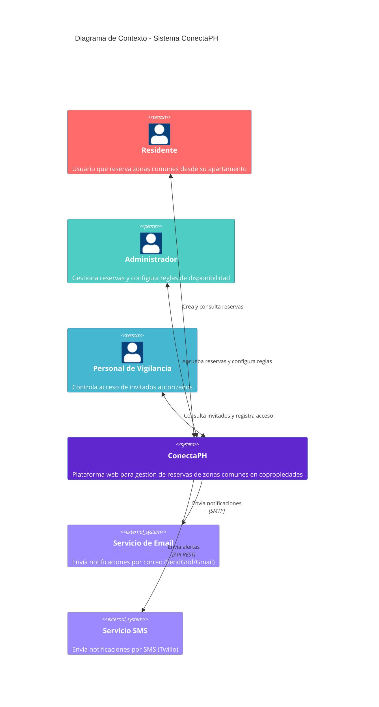
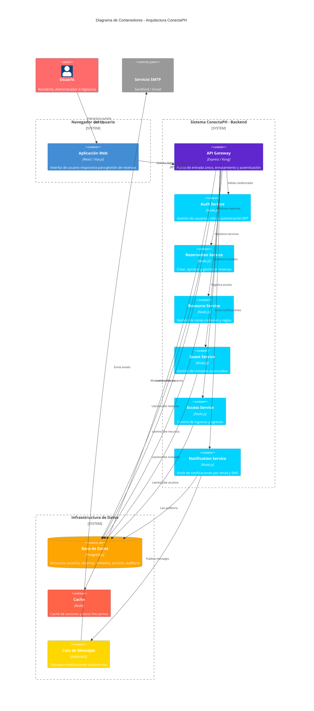
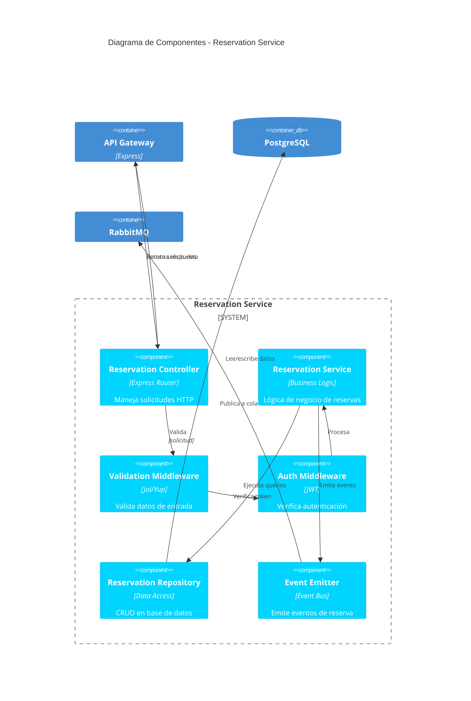
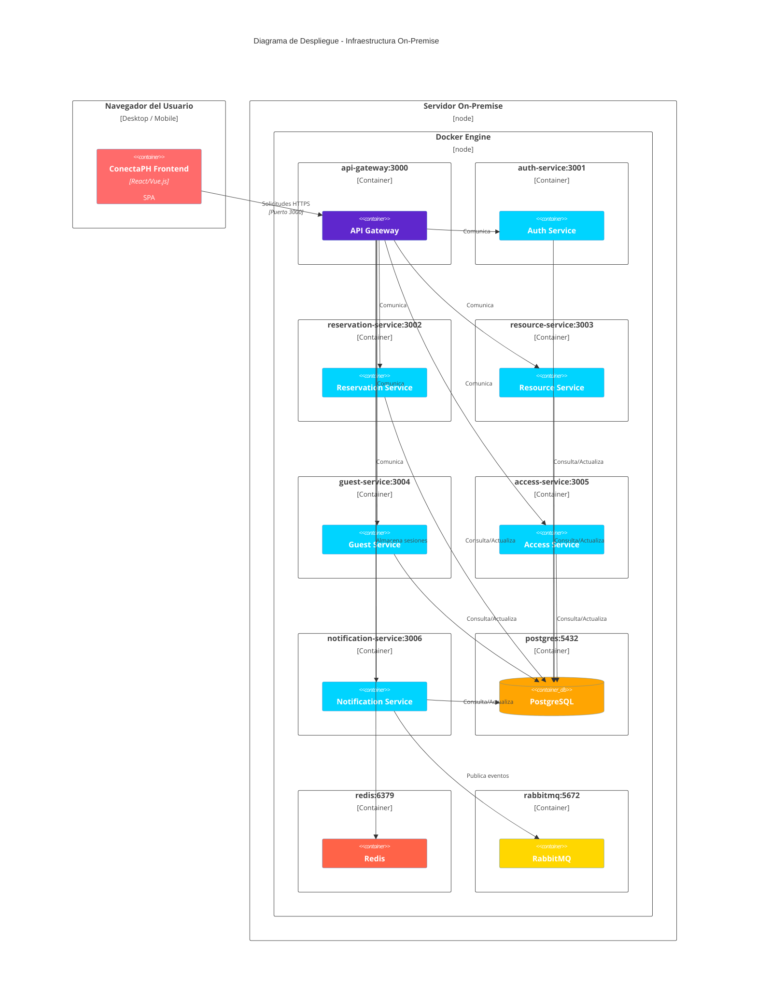
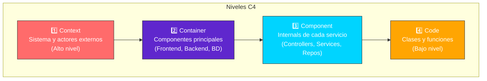

# Diagramas C4 - ConectaPH

> **Diagramas históricos de la primera entrega.** Redis, RabbitMQ, API Gateway y los siete microservicios aquí representados no existen en el repositorio actual y no deben interpretarse como arquitectura implementada. La segunda entrega usa una SPA React, una API Express monolítica modular y PostgreSQL/Prisma; su actualización gráfica completa permanece en `TK-DOC-01`.

Documentación de la arquitectura del sistema ConectaPH usando notación C4.

## 1. Diagrama de Contexto (C4 Context)

Muestra el sistema ConectaPH y sus interacciones con actores externos y sistemas.

---

## 2. Diagrama de Contenedores (C4 Container)

Muestra los contenedores principales: Frontend, Backend (Microservicios), Base de Datos e Infraestructura.

---

## 3. Diagrama de Componentes (C4 Component)

Muestra los componentes internos del Reservation Service como ejemplo detallado de un microservicio.

---

## 4. Diagrama de Despliegue (C4 Deployment)

Muestra cómo se despliegan los contenedores en el ambiente on-premise.

---

## 5. Relaciones entre diagramas C4

---

## Conclusiones

- **Level 1 (Context):** Visión general del sistema y stakeholders
- **Level 2 (Container):** Arquitectura de microservicios con 7 servicios
- **Level 3 (Component):** Detalles internos de cada servicio (ejemplo: Reservation Service)
- **Level 4 (Code):** Implementación específica de clases y métodos (no incluido en diagramas, es código fuente)

La arquitectura C4 permite comunicación clara en diferentes niveles de abstracción según la audiencia.
