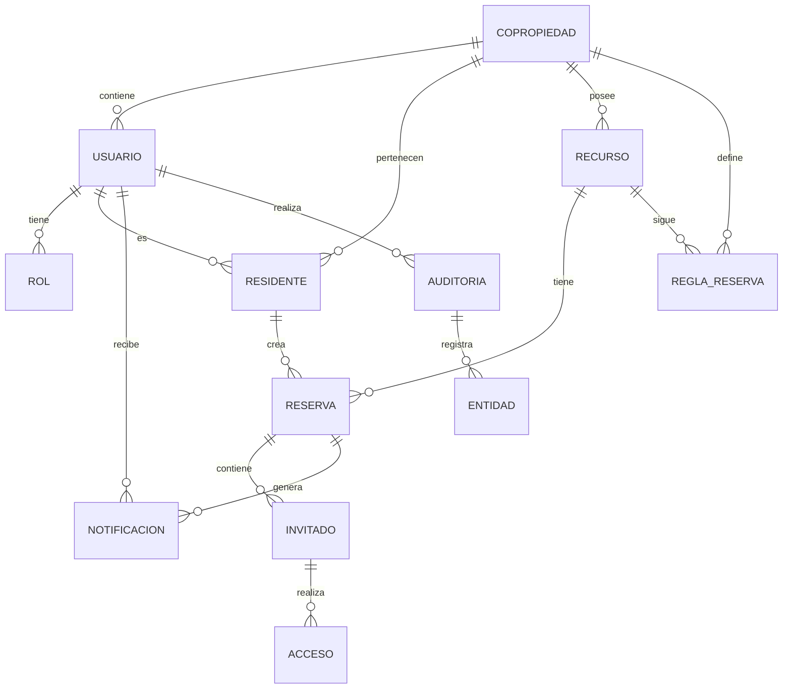

# ConectaPH PRD

> **Documento histórico de la primera entrega.** Sus referencias a registro público, aprobación manual/PENDING, notificaciones, control de accesos y microservicios no describen la implementación actual. Para el alcance y estado verificable de la segunda entrega consulte `README.md`, `5-historias-de-usuario.md` y `trazabilidad.md`. La especificación vigente es el MVP de aprobación automática de reservas, invitados y consulta de vigilancia sobre un monolito modular.

## 1. Propósito del documento

Este documento define el Product Requirements Document (PRD) para ConectaPH, una plataforma web de gestión de reservas de zonas comunes en copropiedades. Está dirigida a residentes, personal de vigilancia y administración, y su objetivo es formalizar el alcance, los requisitos y los criterios de éxito del MVP.

## 2. Problema a resolver

En muchas copropiedades, la gestión de reservas de espacios comunes se realiza de forma manual y fragmentada, lo que genera:

- Reservas duplicadas o conflictos de horario.
- Falta de visibilidad sobre la disponibilidad real de zonas comunes.
- Dificultad para que vigilancia verifique invitados autorizados.
- Comunicación poco clara entre residentes, administración y portería.
- Pérdida de registro histórico de eventos y autorizaciones.

## 3. Público objetivo

- Residentes que desean reservar zonas comunes (salón social, gimnasio, cancha, parque infantil, etc.).
- Personal de administración encargado de aprobar y supervisar reservas.
- Vigilancia y portería que deben validar el acceso de invitados autorizados.

## 4. Objetivos medibles

1. Reducir en un 80% los conflictos de doble reserva en el primer mes de uso.
2. Lograr que el 90% de las reservas se realicen a través de la plataforma en lugar de métodos manuales.
3. Acelerar el tiempo de confirmación de reserva a menos de 10 minutos para el 95% de las solicitudes.
4. Registrar el 100% de las autorizaciones de invitados y reservas en un historial accesible.
5. Aumentar la satisfacción de residentes y vigilancia en un 30% con respecto al proceso anterior.

## 5. User stories principales

### 5.1. Residente

- Como residente, quiero ver la disponibilidad de zonas comunes, para poder reservar un espacio sin interferencias.
- Como residente, quiero solicitar la reserva de una zona común con fecha y hora específicas, para planificar mi evento.
- Como residente, quiero recibir notificaciones de confirmación o rechazo, para estar informado sobre el estado de mi reserva.
- Como residente, quiero consultar mi historial de reservas, para revisar mis eventos pasados y futuros.
- Como residente, quiero indicar los invitados autorizados para mi reserva, para que vigilancia pueda validar el acceso.

### 5.2. Administración

- Como administrador, quiero ver todas las solicitudes de reserva y su estado, para gestionar el uso de las zonas comunes.
- Como administrador, quiero aprobar o rechazar reservas cuando sea necesario, para mantener control sobre la ocupación.
- Como administrador, quiero definir reglas de disponibilidad y duración de las reservas, para evitar abusos y sobrecargas.
- Como administrador, quiero consultar el historial de reservas, para auditar el uso de espacios comunes.

### 5.3. Vigilancia

- Como guardia o portero, quiero consultar la lista de invitados autorizados para una reserva, para controlar el acceso.
- Como guardia o portero, quiero verificar rápidamente la información de la reserva activa, para actuar con seguridad.
- Como guardia o portero, quiero registrar observaciones sobre un ingreso, para documentar incidencias si se presentan.

## 6. Requisitos funcionales

### 6.1. Autenticación y perfiles

- RF1: El sistema debe permitir el registro de residentes, administración y vigilancia.
- RF2: El sistema debe permitir iniciar sesión con credenciales seguras.
- RF3: El sistema debe mostrar el rol del usuario y adaptar la interfaz según su perfil.

### 6.2. Gestión de zonas comunes

- RF4: El sistema debe mantener un catálogo de zonas comunes disponibles para reserva.
- RF5: El sistema debe mostrar la disponibilidad por zona, fecha y horario.
- RF6: El sistema debe permitir filtrar zonas comunes por tipo y capacidad.

### 6.3. Solicitud y administración de reservas

- RF7: El sistema debe permitir que los residentes creen solicitudes de reserva con fecha, hora y zona.
- RF8: El sistema debe validar la disponibilidad antes de confirmar una reserva.
- RF9: El sistema debe permitir la aprobación automática o manual de reservas según reglas.
- RF10: El sistema debe generar notificaciones de estado de reserva (pendiente, aprobada, rechazada).
- RF11: El sistema debe mantener un historial de todas las reservas y su estado.
- RF12: El sistema debe permitir la edición o cancelación de reservas hasta un plazo definido.

### 6.4. Invitados autorizados y seguridad

- RF13: El sistema debe permitir que el residente agregue una lista de invitados autorizados a la reserva.
- RF14: El sistema debe mostrar la lista de invitados autorizados a vigilancia para cada reserva activa.
- RF15: El sistema debe permitir a vigilancia marcar el ingreso como autorizado o solicitar verificación adicional.

### 6.5. Notificaciones y comunicación

- RF16: El sistema debe enviar notificaciones internas o por correo cuando cambie el estado de una reserva.
- RF17: El sistema debe avisar a los residentes sobre reservas próximas y cambios relevantes.

## 7. Requisitos no funcionales

- RNF1: La plataforma debe ser accesible desde navegadores modernos en desktop y mobile.
- RNF2: El tiempo de carga de las pantallas principales no debe superar 2 segundos.
- RNF3: El sistema debe ser capaz de soportar al menos 500 usuarios simultáneos en la misma copropiedad.
- RNF4: Los datos deben almacenarse de forma segura y cumplir criterios básicos de protección de información personal.
- RNF5: La plataforma debe ser escalable para permitir la incorporación de nuevos módulos en el futuro.
- RNF6: El sistema debe registrar eventos clave de auditoría, como creación, modificación y cancelación de reservas.
- RNF7: El sistema debe ser capaz de manejar análisis de disponibilidad y reservas sin pérdida de datos.

## 8. Criterios de éxito

- CS1: El sistema registra y gestiona correctamente al menos 95% de las solicitudes de reserva en el primer mes.
- CS2: Los usuarios reportan que el proceso de reserva es más rápido y transparente que el método manual.
- CS3: No se presentan más del 5% de conflictos de doble reserva en el mes inicial.
- CS4: El 100% de las reservas aprobadas incluyen la lista de invitados autorizados cuando aplica.
- CS5: La administración y vigilancia pueden consultar una reserva activa y sus invitados en menos de 30 segundos.
- CS6: La plataforma mantiene un historial de reservas completo accesible para todos los roles con permisos.

## 9. Alcance del MVP

Este PRD se centra en el MVP de gestión de reservas de zonas comunes con soporte para residentes, administración y vigilancia. No incluye, por ejemplo, pagos de cuotas, reporte de incidencias, ni módulos avanzados de comunicación entre vecinos.

## 10. Supuestos y dependencias

- La copropiedad ya cuenta con acceso a internet para uso de la plataforma.
- Los usuarios tienen un correo electrónico válido para notificaciones.
- El equipo de administración define las reglas de uso de las zonas comunes.
- La infraestructura se desplegará en un entorno web seguro y accesible.

## 11. Casos de uso principales

### UC-1: Registrarse en la plataforma

**Actores:** Residente, Administrador, Vigilancia

**Descripción:** El usuario ingresa sus datos personales (nombre, email, teléfono, apartamento/unidad) y crea credenciales de acceso. El sistema valida la información y asigna el rol correspondiente.

**Flujo principal:**
1. Usuario accede al formulario de registro.
2. Ingresa datos personales y crea contraseña.
3. Sistema valida y crea la cuenta.
4. Se envía email de confirmación.
5. Usuario confirma email y accede al sistema.

---

### UC-2: Iniciar sesión

**Actores:** Residente, Administrador, Vigilancia

**Descripción:** El usuario ingresa sus credenciales y accede al sistema adaptado a su rol.

**Flujo principal:**
1. Usuario ingresa email y contraseña.
2. Sistema valida credenciales.
3. Sistema muestra dashboard según el rol del usuario.

---

### UC-3: Visualizar disponibilidad de zonas comunes

**Actores:** Residente

**Descripción:** El residente consulta el calendario de disponibilidad de zonas comunes para identificar espacios libres.

**Flujo principal:**
1. Residente accede a la sección "Reservas".
2. Selecciona una zona común (salón, gimnasio, cancha, etc.).
3. Sistema muestra calendario con disponibilidad actual.
4. Residente filtra por fecha, horario o tipo de zona.

---

### UC-4: Solicitar reserva de zona común

**Actores:** Residente

**Descripción:** El residente crea una solicitud de reserva para una zona común en una fecha y horario específicos.

**Flujo principal:**
1. Residente selecciona zona, fecha y horario deseado.
2. Completa el formulario con detalles del evento (propósito, número de personas, etc.).
3. Agrega invitados (nombres y datos de contacto).
4. Envía la solicitud.
5. Sistema valida disponibilidad y crea la reserva en estado "Pendiente".
6. Residente recibe confirmación inmediata.

---

### UC-5: Aprobar o rechazar reserva (Administración)

**Actores:** Administrador

**Descripción:** El administrador revisa las solicitudes de reserva pendientes y decide aprobarlas o rechazarlas según las reglas de la copropiedad.

**Flujo principal:**
1. Administrador accede al panel de "Reservas pendientes".
2. Revisa detalles de la solicitud.
3. Valida contra reglas configuradas (duración máxima, número de eventos, etc.).
4. Aprueba o rechaza la solicitud.
5. Sistema envía notificación al residente.

---

### UC-6: Consultar estado de reserva

**Actores:** Residente

**Descripción:** El residente consulta el estado de sus solicitudes de reserva.

**Flujo principal:**
1. Residente accede a "Mis reservas".
2. Ve listado de reservas activas, próximas y pasadas.
3. Puede ver detalles: estado, fecha, horario, invitados.

---

### UC-7: Agregar invitados autorizados

**Actores:** Residente

**Descripción:** El residente agrega una lista de invitados autorizados a su reserva para que vigilancia pueda verificar su acceso.

**Flujo principal:**
1. Residente accede a los detalles de su reserva.
2. Selecciona "Agregar invitados".
3. Ingresa nombre, cédula o identificación de cada invitado.
4. Guardala lista de invitados.
5. Sistema notifica a vigilancia.

---

### UC-8: Consultar invitados autorizados (Vigilancia)

**Actores:** Vigilancia

**Descripción:** Vigilancia consulta la lista de invitados autorizados para una reserva activa y verifica el acceso.

**Flujo principal:**
1. Vigilancia accede al panel "Eventos del día".
2. Selecciona una reserva activa.
3. Visualiza lista de invitados autorizados con datos clave.
4. Marca el ingreso de invitados conforme se presentan.
5. Registra observaciones si es necesario.

---

### UC-9: Cancelar o editar reserva

**Actores:** Residente

**Descripción:** El residente modifica o cancela una reserva existente dentro del plazo permitido.

**Flujo principal:**
1. Residente accede a "Mis reservas".
2. Selecciona una reserva no confirmada o que aún permite cambios.
3. Elige editar (cambiar fecha/hora) o cancelar.
4. Confirma los cambios.
5. Sistema actualiza disponibilidad y notifica a administración si corresponde.

---

### UC-10: Ver historial de reservas

**Actores:** Residente, Administrador, Vigilancia

**Descripción:** Los usuarios consultan un registro histórico de todas las reservas realizadas, con filtros y detalles.

**Flujo principal:**
1. Usuario accede a "Historial de reservas".
2. Filtra por período, zona, estado o residente (según rol).
3. Visualiza listado de reservas pasadas y presentes.
4. Puede exportar o generar reportes.

---

### UC-11: Configurar reglas de disponibilidad (Administración)

**Actores:** Administrador

**Descripción:** El administrador define reglas para la reserva de zonas comunes, como duración máxima, número de eventos por residente, horarios disponibles, etc.

**Flujo principal:**
1. Administrador accede a "Configuración de zonas".
2. Selecciona una zona común.
3. Define parámetros: horario de apertura/cierre, duración máxima, máximo de eventos por mes, etc.
4. Guarda los cambios.
5. Sistema aplica las reglas a nuevas solicitudes y valida automáticamente.

---

### UC-12: Recibir notificaciones

**Actores:** Residente, Administrador, Vigilancia

**Descripción:** El sistema notifica a los usuarios sobre cambios relevantes en sus reservas o actividades.

**Flujo principal:**
1. Sistema detecta un evento relevante (reserva aprobada, invitado agregado, cambio en horario, etc.).
2. Envía notificación por email o en el dashboard según preferencias.
3. Usuario visualiza y confirma la notificación.

---

## 12. Modelo de datos

### 12.1. Diagrama del modelo de datos (ER)

### 12.2. Descripción de entidades principales

#### **1. Copropiedad**
Representa la unidad de negocio principal - la comunidad residencial.

| Campo | Tipo | Descripción |
|-------|------|------------|
| id | UUID | Identificador único |
| nombre | String | Nombre de la copropiedad |
| dirección | String | Ubicación física |
| ciudad | String | Ciudad donde se ubica |
| teléfono | String | Contacto general |
| email | String | Email administrativo |
| total_unidades | Integer | Número de apartamentos/viviendas |
| fecha_creación | DateTime | Fecha de registro |
| estado | Enum | Activa, Inactiva |

---

#### **2. Usuario**
Persona que interactúa con el sistema (puede ser residente, administrador o vigilancia).

| Campo | Tipo | Descripción |
|-------|------|------------|
| id | UUID | Identificador único |
| email | String | Email único del usuario |
| contraseña_hash | String | Contraseña encriptada |
| nombre | String | Nombre completo |
| apellido | String | Apellido |
| teléfono | String | Contacto telefónico |
| copropiedad_id | UUID | FK a Copropiedad |
| estado | Enum | Activo, Inactivo, Suspendido |
| fecha_creación | DateTime | Fecha de registro |
| fecha_última_sesión | DateTime | Último acceso |

---

#### **3. Rol**
Define los permisos y funciones dentro del sistema.

| Campo | Tipo | Descripción |
|-------|------|------------|
| id | UUID | Identificador único |
| nombre | String | Residente, Administrador, Vigilancia |
| descripción | String | Descripción del rol |
| permisos | JSON | Lista de permisos asociados |

---

#### **4. Usuario_Rol** (Relación Many-to-Many)
Asocia múltiples roles a un usuario (un usuario puede tener varios roles).

| Campo | Tipo | Descripción |
|-------|------|------------|
| usuario_id | UUID | FK a Usuario |
| rol_id | UUID | FK a Rol |
| fecha_asignación | DateTime | Cuándo se asignó el rol |

---

#### **5. Residente**
Información específica del residente de la copropiedad.

| Campo | Tipo | Descripción |
|-------|------|------------|
| id | UUID | Identificador único |
| usuario_id | UUID | FK a Usuario (1:1) |
| copropiedad_id | UUID | FK a Copropiedad |
| apartamento | String | Número de apartamento/vivienda |
| piso | Integer | Piso donde vive |
| teléfono_emergencia | String | Contacto de emergencia |
| propietario | Boolean | Es propietario o arrendatario |
| fecha_ingreso | DateTime | Cuándo se unió a la comunidad |

---

#### **6. Recurso** (Zona Común)
Espacios disponibles para reserva en la copropiedad.

| Campo | Tipo | Descripción |
|-------|------|------------|
| id | UUID | Identificador único |
| copropiedad_id | UUID | FK a Copropiedad |
| nombre | String | Nombre del recurso (salón, gimnasio, cancha, etc.) |
| descripción | String | Descripción detallada |
| tipo | Enum | Salón, Gimnasio, Parque, Cancha, Otro |
| capacidad | Integer | Número máximo de personas |
| ubicación | String | Ubicación dentro de la copropiedad |
| amenidades | JSON | Lista de facilidades (wifi, aire acondicionado, etc.) |
| imagen_url | String | URL de foto del recurso |
| estado | Enum | Disponible, En mantenimiento, Inactivo |

---

#### **7. Regla_Reserva**
Configuración de reglas y restricciones para la reserva de recursos.

| Campo | Tipo | Descripción |
|-------|------|------------|
| id | UUID | Identificador único |
| recurso_id | UUID | FK a Recurso |
| duracion_minima | Integer | Mínimo de horas para reserva |
| duracion_maxima | Integer | Máximo de horas por reserva |
| max_reservas_por_mes | Integer | Número máximo de reservas por residente al mes |
| horario_apertura | Time | Hora de apertura del recurso |
| horario_cierre | Time | Hora de cierre del recurso |
| dias_reserva_anticipada | Integer | Días previos permitidos para reservar |
| requiere_aprobacion | Boolean | Si necesita aprobación manual |
| fecha_actualización | DateTime | Cuándo se actualizó la regla |

---

#### **8. Reserva**
Registro de cada reserva de zona común realizada por un residente.

| Campo | Tipo | Descripción |
|-------|------|------------|
| id | UUID | Identificador único |
| residente_id | UUID | FK a Residente |
| recurso_id | UUID | FK a Recurso |
| fecha_inicio | DateTime | Fecha y hora de inicio |
| fecha_fin | DateTime | Fecha y hora de finalización |
| estado | Enum | Pendiente, Aprobada, Rechazada, Cancelada, Completada |
| descripcion_evento | String | Propósito de la reserva |
| numero_personas | Integer | Cantidad de personas esperadas |
| notas_residente | String | Notas adicionales del residente |
| fecha_creación | DateTime | Cuándo se creó la reserva |
| fecha_aprobacion | DateTime | Cuándo fue aprobada (si aplica) |
| aprobado_por | UUID | FK a Usuario (Administrador que aprobó) |

---

#### **9. Invitado**
Personas autorizadas a asistir a una reserva que no son residentes.

| Campo | Tipo | Descripción |
|-------|------|------------|
| id | UUID | Identificador único |
| reserva_id | UUID | FK a Reserva |
| nombre_completo | String | Nombre del invitado |
| cedula_identidad | String | Cédula o identificación |
| email | String | Email del invitado (opcional) |
| teléfono | String | Teléfono del invitado (opcional) |
| estado_ingreso | Enum | Pendiente, Autorizado, Rechazado, Ingresó |
| fecha_creación | DateTime | Cuándo se agregó a la lista |

---

#### **10. Acceso**
Registro de ingresos y egresos de invitados autorizados.

| Campo | Tipo | Descripción |
|-------|------|------------|
| id | UUID | Identificador único |
| invitado_id | UUID | FK a Invitado |
| fecha_hora_ingreso | DateTime | Cuándo ingresó |
| fecha_hora_egreso | DateTime | Cuándo salió (nullable) |
| autorizado | Boolean | Si fue autorizado |
| registrado_por | UUID | FK a Usuario (Vigilancia) |
| observaciones | String | Notas sobre el ingreso |

---

#### **11. Notificación**
Registro de notificaciones enviadas a usuarios sobre cambios en reservas.

| Campo | Tipo | Descripción |
|-------|------|------------|
| id | UUID | Identificador único |
| usuario_id | UUID | FK a Usuario |
| reserva_id | UUID | FK a Reserva (nullable) |
| tipo | Enum | Reserva_Aprobada, Reserva_Rechazada, Invitado_Agregado, Recordatorio |
| contenido | String | Mensaje de la notificación |
| canal | Enum | Email, InApp, SMS |
| leida | Boolean | Si el usuario la leyó |
| fecha_creación | DateTime | Cuándo se envió |
| fecha_lectura | DateTime | Cuándo se leyó (nullable) |

---

#### **12. Auditoría**
Registro de todas las acciones importantes realizadas en el sistema para trazabilidad.

| Campo | Tipo | Descripción |
|-------|------|------------|
| id | UUID | Identificador único |
| usuario_id | UUID | FK a Usuario que realizó la acción |
| entidad | String | Tipo de entidad afectada (Reserva, Invitado, etc.) |
| entidad_id | UUID | ID de la entidad afectada |
| accion | Enum | Crear, Actualizar, Eliminar, Aprobar |
| datos_anteriores | JSON | Estado previo (para actualización) |
| datos_nuevos | JSON | Nuevo estado |
| fecha_acción | DateTime | Cuándo ocurrió |
| dirección_ip | String | IP del usuario |
| descripción | String | Descripción de la acción |

---

### 12.3. Relaciones principales

| Relación | Tipo | Descripción |
|----------|------|------------|
| Copropiedad → Usuario | 1:N | Una copropiedad tiene muchos usuarios |
| Copropiedad → Residente | 1:N | Una copropiedad tiene muchos residentes |
| Copropiedad → Recurso | 1:N | Una copropiedad posee muchas zonas comunes |
| Usuario → Rol | M:N | Un usuario puede tener varios roles |
| Usuario → Residente | 1:1 | Un usuario puede ser un residente único |
| Residente → Reserva | 1:N | Un residente puede hacer muchas reservas |
| Recurso → Reserva | 1:N | Un recurso puede tener muchas reservas |
| Recurso → Regla_Reserva | 1:N | Un recurso tiene sus reglas específicas |
| Reserva → Invitado | 1:N | Una reserva puede tener muchos invitados |
| Invitado → Acceso | 1:N | Un invitado puede tener múltiples registros de acceso |
| Usuario → Notificación | 1:N | Un usuario puede recibir muchas notificaciones |
| Usuario → Auditoría | 1:N | Un usuario realiza múltiples acciones auditadas |

---

### 12.4. Índices recomendados

- `Usuario.email` - Búsqueda rápida en login
- `Reserva.residente_id, fecha_inicio` - Consultar reservas del residente
- `Reserva.recurso_id, fecha_inicio` - Detectar conflictos de disponibilidad
- `Reserva.estado` - Filtrar por estado
- `Invitado.reserva_id` - Buscar invitados de una reserva
- `Acceso.fecha_hora_ingreso` - Consultas de seguridad en tiempo real
- `Auditoría.usuario_id, fecha_acción` - Trazabilidad de acciones

---

## 13. Resumen de componentes (Diagrama C4)

Este resumen recoge los componentes clave representados en los diagramas C4 creados para ConectaPH y su propósito dentro del sistema.

- **Context (Nivel 1):** Actores externos y el sistema. Incluye a `Residente`, `Administrador`, `Vigilancia`, y servicios externos (email/SMS). Muestra límites del sistema y dependencias externas.

- **Container (Nivel 2):** Contenedores principales:
    - `Frontend` (React/Vue) — SPA que consume la API.
    - `API Gateway` — Enrutamiento, autenticación y rate limiting.
    - Microservicios: `Auth Service`, `Reservation Service`, `Resource Service`, `Guest Service`, `Access Service`, `Notification Service` — cada uno responsable de un dominio claro (autenticación, reservas, recursos, invitados, control de accesos, notificaciones).
    - Infraestructura: `PostgreSQL` (BD relacional compartida), `Redis` (cache/sesiones), `RabbitMQ` (cola para tareas asíncronas).

- **Component (Nivel 3):** Componentes internos de ejemplo (Reservation Service):
    - `Reservation Controller` — Rutas HTTP y validación básica.
    - `Reservation Service` — Lógica de negocio y reglas de reserva.
    - `Reservation Repository` — Acceso a datos y consultas a PostgreSQL.
    - `Validation Middleware`, `Auth Middleware` — Validación y seguridad.
    - `Event Emitter` — Publica eventos a la cola para notificaciones y procesos asíncronos.

- **Deployment (Nivel 4):** Despliegue on-premise en contenedores Docker:
    - Cada microservicio, la base de datos, Redis y RabbitMQ corren en contenedores gestionados por Docker Engine.
    - El `API Gateway` expone el puerto público y enruta tráfico interno hacia los microservicios.

**Notas de diseño:**
- Separación por dominios facilita escalado y despliegues independientes.
- Compartir una única instancia de PostgreSQL simplifica consistencia pero requiere buenas prácticas de migraciones y backups.
- Uso de cola (`RabbitMQ`) para desacoplar envío de emails y tareas largas.

---

Fecha de actualización: 2026-06-15

